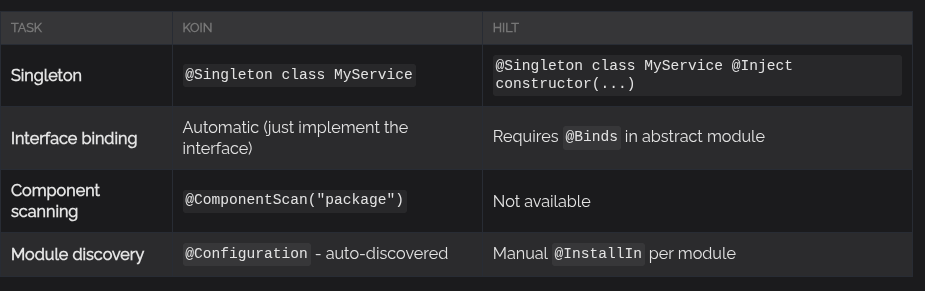
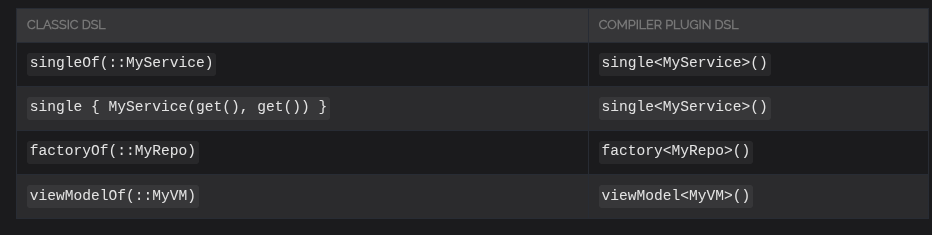

## Что такое Koin

Koin - легковесный DI framework, в котором можно делать DI через аннотации или через Kotlin DSL.

### Koin DI через Kotlin DSL

```kotlin
val appModule = module {
    single<Database>()
    single<ApiClient>()
    single<UserRepository>()
    viewModel<UserViewModel>
}
```

### Koin DI через аннотации

```kotlin
@Singleton
class Databaase {
    //...
}

@Singleton
class ApiClient {
    //...
}

@Singleton
class UserRepository(
    private val db: Database,
    private val apiClient: ApiClient
) {
    //...
}

@KoinViewModel
class UserViewModel(
    private val userRepository: UserRepository
) : ViewModel() {
    //...
}
```

### Сравнение Koin-аннотаций и Dagger/Hilt

Аннотации-Koin намного проще, чем аналогичные в dagger/hilt.

@Singleton в Koin не требует дополнительно писать @Inject constructor

Koin умеет автоматически @Binds классы к интерфейсам, в koin нет binds-методов, они под капотом.

В Kotlin есть @ComponentScan("packageName"), этого нет в dagger/hilt

Koin автоматически распознает модули. В Hilt нам приходится юзать @InstallIn



### Примеры сравнения Koin-annotations и dagger/hilt

```kotlin
//Koin:

@Singleton
class MyRepository(private val api: ApiService)

@Module
@ComponentScan("com.myapp")
class AppModule
```

```kotlin
//Hilt - более неудобный

@Singleton
class MyRepository @Inject constructor(
    private val api: ApiService
)

@Module
@InstallIn(SingletonComponent::class)
abstract class AppModule {
    @Binds
    abstract fun bindMyRepository(repository: MyRepository): Repository
}
```

### Koin Compiler Plugin
Раньше Koin юзал KSP, но перешел на свой собственный Koin Compiler Plugin.

Koin Compiler Plugin:
- работает с K2-компилятором Kotlin
- проверяет DI на ошибке на этапе сборки
- работает и с DSL, и с аннотациями.
- автоматически распознает DI constructor injection

С использованием Koin Compiler Plugin немного поменялся синтаксис



Вообще можно и делать DI без Koin Compiler Plugin, просто тогда не будет анализа DI на ошибки во время сборки и тд.

### Koin DI через классический DSL
Если мы не хотим юзать Koin Compiler Plugin, то
классический DSL все еще поддерживается.

Но там немного другой синтаксис в dsl

```kotlin
val appModule = module {
    singleOf(::Database)
    singleOf(::ApiClient)
    singleOf(::UserRepository)
    viewModelOf(::UserViewModel)
}

//or
val appModule = module {
    single { Database() }
    single { ApiClient() }
    single { UserRepository(get(), get()) }
    viewModel { UserViewModel(get()) }
}
```

### Раньше был Koin + KSP - он теперь deprecated

### Для кого подойдет Koin

- для команд, которые хотят меньше бойлерплейта и больше продуктивности при внедрении DI

- для Android-разработчиков, которые хотят более легкий и чистый DI, чем dagger/hilt

- для KMP (Kotlin multiplatform)

- для всех, кто считает, что DI не должен быть сложным.