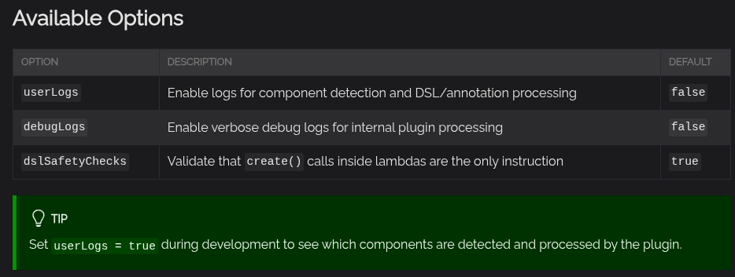

## Установка Koin в Android-проект

### Koin BOM

Koin BOM - Bill of Models - зависимость Gradle, которая управляет версиями остальных Koin. И чтобы версии разных koin-зависимостей были совместимы друг с другом и тд.

### Вообще все возможные koin-зависимости
Вот они libs.versions.toml

```
[versions]
koin-bom = "4.2.0"

[libraries]
koin-bom = { module = "io.insert-koin:koin-bom", version.ref = "koin-bom" }
#no version for dependencies below - versions are controlled by BOM
koin-core = { module = "io.insert-koin:koin-core" }
koin-android = { module = "io.insert-koin:koin-android" }
koin-compose = { module = "io.insert-koin:koin-compose" }
koin-compose-viewmodel = { module = "io.insert-koin:koin-compose-viewmodel" }
koin-ktor = { module = "io.insert-koin:koin-ktor" }
koin-test = { module = "io.insert-koin:koin-test" }
```

и потом пишем в gradle:

```kotlin
dependencies {
    implementation(platform(libs.koin.bom))
    implementation(libs.koin.android)
    //...
}
```

### Установка koin для чистых kotlin-приложений

```kotlin
dependencies {
    implementation(platform("io.insert-koin:koin-bom:$koin_version"))
    implementation("io.insert-koin:koin-core")

    //если нужно для тестов
    testImplementation("io.insert-koin:koin-test")
     // junit5 or junit4
    testImplementation("io.insert-koin:koin-test-junit5") 
}
```

И далее в main() просто запускаем koin

```kotlin
fun main() {
    startKoin {
        modules(appModule)
    }
}
```

### Установка koin для android

```kotlin
dependencies {
    implementation(platform("io.insert-koin:koin-bom:$koin_version"))
    //koin-android уже содержит внутри себя koin-core
    implementation("io.insert-koin:koin-android")

    //дополнительно можно добавить:
    // Jetpack WorkManager
    implementation("io.insert-koin:koin-androidx-workmanager")
    // Navigation Graph
    implementation("io.insert-koin:koin-androidx-navigation")
    // AndroidX Startup
    implementation("io.insert-koin:koin-androidx-startup")
    // Java Compatibility
    implementation("io.insert-koin:koin-android-compat")

    //если юзаем Jetpack Compose:
    implementation("io.insert-koin:koin-compose")
    implementation("io.insert-koin:koin-compose-viewmodel")

    //и еще в Compose есть разница для Navigation-component 2 и 3 версии
    implementation("io.insert-koin:koin-androidx-compose-navigation")
    //or
    implementation("io.insert-koin:koin-compose-navigation3")
}
```

Koin запускается в application-классе

```kotlin
class MyApplication : Application() {

    override fun onCreate() {
        super.onCreate()
        startKoin {
            androidLogger()

            //это аналог BindsInstance
            //чтоббы в графе всегда был applicationContext
            // androidContext(this@MyApplication)

            modules(appModule)
        }
    }
}
```

## Koin Compiler Plugin
Рекомендуется установить Koin Compiler Plugin, чтобы были:

- автодополнение кода
- проверка DI во время сборки проекта 
- более чистый DSL-синтаксис

-----------------

Koin Compiler Plugin работает с K2 компилятором, поэтому доступен только на

- Kotlin 2.3+ 

- Gradle 8+

### Устанавливаем Koin Compiler Plugin

```
[versions]
koin = "<KOIN_VERSION>"
koin-plugin = "<KOIN_PLUGIN_VERSION>"

[libraries]
koin-core = { module = "io.insert-koin:koin-core", version.ref = "koin" }
koin-annotations = { module = "io.insert-koin:koin-annotations", version.ref = "koin" }
#other koin dependencies

[plugins]
koin-compiler = { id = "io.insert-koin.compiler.plugin", version.ref = "koin-plugin" }
```

Проверяем, что settings.gradle такой

```kotlin
pluginManagement {
    repositories {
        mavenCentral()
        gradlePluginPortal()
    }
}
```

подключаем плагин
```kotlin
//build.gradle (project level)
plugins {
    alias(lbs.plugins.koin.compiler) apply false
}
```

```kotlin
//build.gradle (module level, for example :app)
plugins {
    alias(libs.plugins.koin.compiler)
}

dependencies {
    implementation(libs.koin.core)
    // Обязательно, если мы хотим юзать koin с аннотациями
    implementation(libs.koin.annotations)  
    // и другие koin зависимости
}
```

### Koin DSL с плагином Koin Compiler Plugin и без него 

PS. Koin DSL без Koin-плагина еще зовется Classic-DSL

Если юзать Classic DSL - импорты из org.koin.dsl

Если юзать Koin-DSL с плагином-Koin - импорты из org.koin.plugin.module.dsl

### Синтаксис после подключения Koin Compiler Plugin изменится немного
Синтаксис Koin-DSL:
```kotlin
import org.koin.plugin.module.dsl.*
import org.koin.dsl.module

val appModule = module {
    single<Database>()
    single<ApiClient>()
    single<UserRepository>()
    viewModel<UserViewModel>()
}
```

Синтаксис Koin-annotations:

```kotlin
@Singleton
class Database

@Singleton
class ApiClient

@Singleton
class UserRepository(
    private val database: Database,
    private val apiClient: ApiClient
)

@KoinViewModel
class UserViewModel(private val repository: UserRepository) : ViewModel()

@Module
@ComponentScan("com.myapp")
class AppModule

@KoinApplication
@ComponentScan("com.myapp")
class MyApplication
```

### Можно настроить Koin Compiler Plugin в gradle

```kotlin
koinCompiler {
    userLogs = true
    debugLogs = false
    dslSafetyChecks = true
}
```

